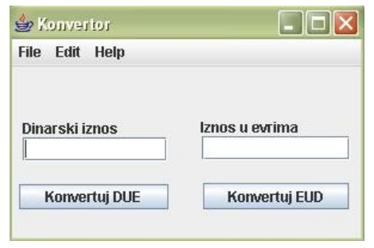
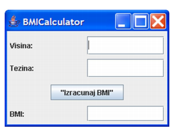

#Lab no. 12

##Problem 1
*(worked through by the TA with students' help)*

Create class **Convertor** in package **problem1.business_logic** that has:

1. Public method **convertDIE** that gets amount in dinars (as a real number) as an input argument. This
method converts this amount into euros and returns that amount (1EUR = 120DIN).

2. Public method **convertEID** that gets amount in euros (as a real number) as an input argument. This
method converts this amount into dinars and returns that amount (1EUR = 120DIN).

Create class **convertorGUI** in package **problem1.gui**, as shown in the drawing, and connect it to class Convertor such that:

1. It has a private attribute **convertor** of type **Convertor**

2. When the button **Convert DIE** is clicked, the amount in dinars that has been entered into the left input field
is converted into euros, and shown in the right input field.

3. When the button **Convert EID** is clicked, the amount in euros that has been entered into the right input field
is converted into dinars, and shown in the left input field.

##Problem 2
*(students work on their own)*

Create public class **Convertor** in package **problem2.business_logic** that has:

1. Public method **calculateBMI** that gets height and width of a person (as real numbers)
as its input arguments. The method calculates and returns BMI, Body Mass Index, using the following formula:
BMI = weight (kg) / (height (m))^2

2. Create class **BMICalculatorGUI** in package **problem2.gui** that creates the user interface shown in
the following figure. When the user enters the height and width data into the respective fields and clicks
the "Calculate BMI" button, the BMI field shows the calculated BMI value. BMI should be calculated using
the method **calculateBMI** from the class **BMICalculator**.

