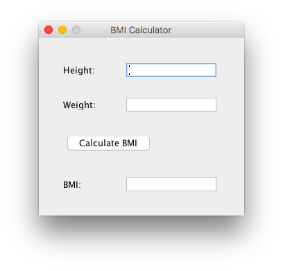

# Lab no. 12

To create the GUI, enable the Window Builder's lazy code generation option in
Window > Preferences > WindowBuilder > Swing > CodeGeneration > Lazy

## Problem 1
*(to be done by the TA with students' help)*

Create class **Converter** in package **problem1.business_logic** that has:

1. Public method **convertDIE** that gets amount in RSD (as a real number) as an input argument. The
method converts this amount into the equivalent amount in Euros and returns the result (1EUR = 120RSD).

2. Public method **convertEID** that gets amount in Euros (as a real number) as an input argument. The
method converts this amount into RSD and returns the result (1EUR = 120RSD).

Create class **ConvertorGUI** in package **problem1.gui**, which creates GUI as the one shown in the figure below. Assure that the GUI's dimensions are not editable. In addition, the following applies to the **ConvertorGUI** class:

1. It has a private attribute **converter** of type **Converter**

2. When the button **Convert DIE** is clicked, the amount in RSD that has been entered into the left input field
is converted into Euros, and shown in the right input field.

3. When the button **Convert EID** is clicked, the amount in Euros that has been entered into the right input field
is converted into RSD, and shown in the left input field.

## Problem 2
*(students work on their own)*

Create public class **BMICalculator** in package **problem2.business_logic** that has:

1. Public method **calculateBMI** that gets height and weight of a person (as real numbers) as its input arguments. The method calculates and returns BMI, Body Mass Index, using the following formula:
BMI = weight (kg) / (height (m))^2

Create class **BMICalculatorGUI** in package **problem2.gui** that creates the user interface as shown in
the following figure. Assure that the GUI's dimensions are not editable. In addition, the following applies to the **BMICalculatorGUI** should have:

1. Private attribute **bmiCalculator** of type **BMICalculator**.

2. When the user enters the height and weight data into the respective fields and clicks
the "Calculate BMI" button, the BMI field shows the calculated BMI value. BMI should be calculated using
the method **calculateBMI** from the class **BMICalculator**.

